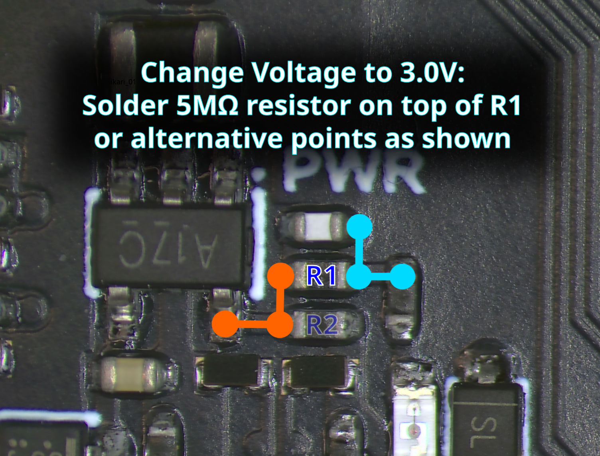
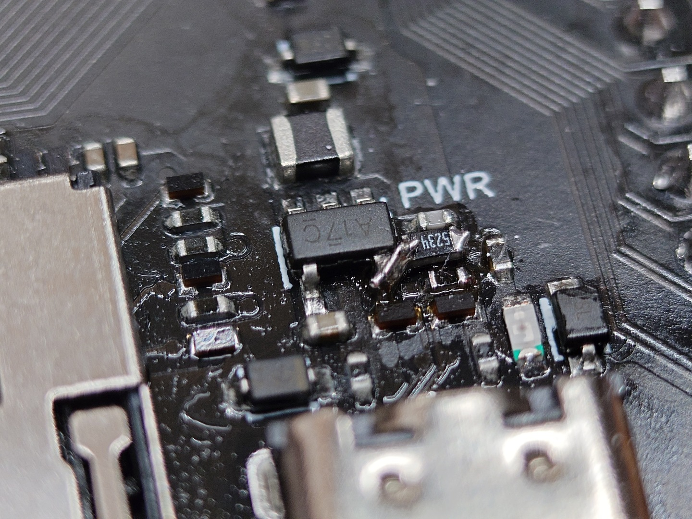
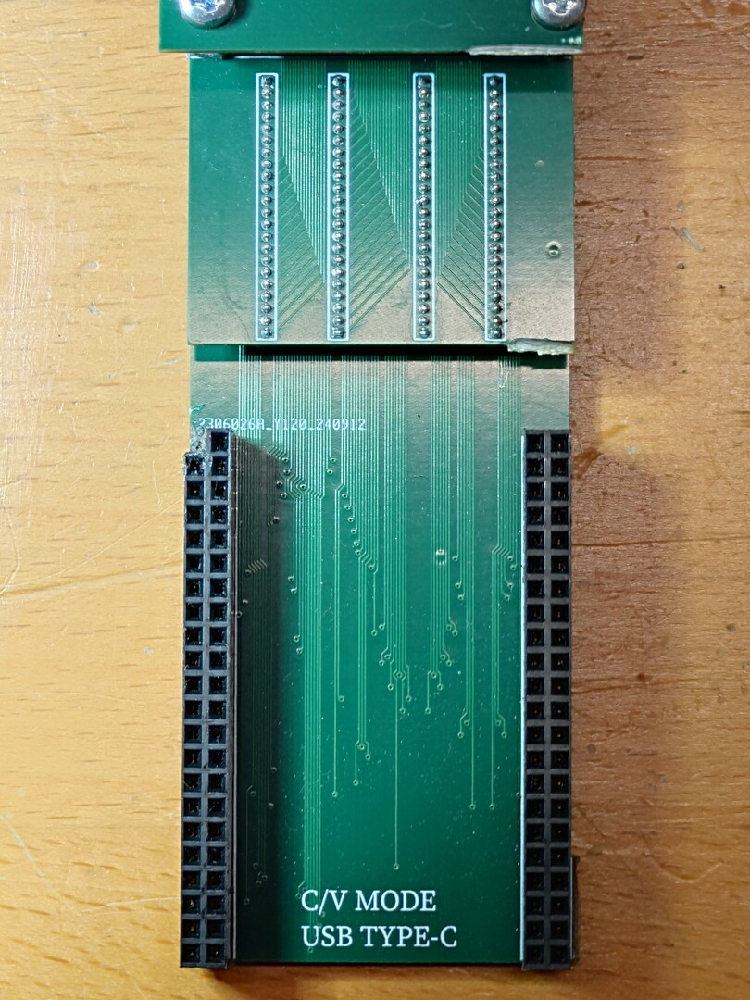
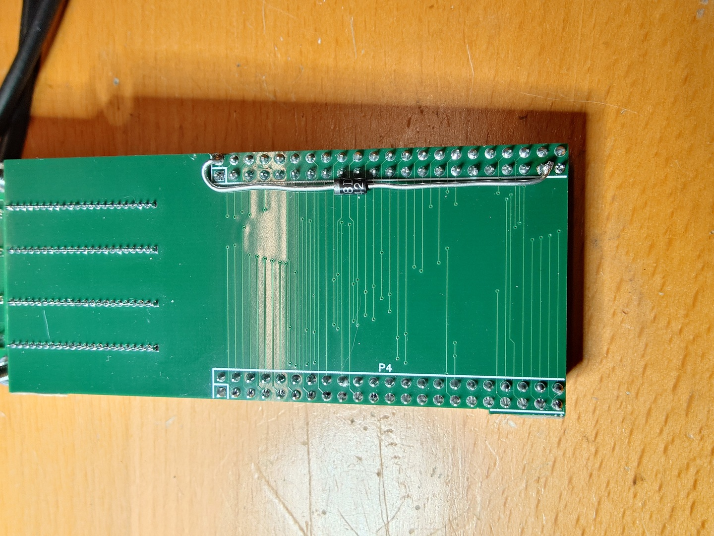

# Changes and optimizations made to the dumper/programmer firmware

## Table of Contents

- [Table of Contents](#table-of-contents)
- [Abstract](#abstract)
- [Quality of Life / Fitness for purpose](#quality-of-life--fitness-for-purpose)
- [Performance improvements](#performance-improvements)
- [Note about supply voltage for F0095H0 chips](#note-about-supply-voltage-for-f0095h0-chips)
  - [Method 1 - Reduce operating voltage of the entire WeAct board to 3.0V](#method-1---reduce-operating-voltage-of-the-entire-weact-board-to-30v)
    - [Advantages](#advantages)
    - [Disadvantages](#disadvantages)
    - [How to do it](#how-to-do-it)
    - [Background](#background)
  - [Method 2 - Reduce supply voltage to each of the adapter boards](#method-2---reduce-supply-voltage-to-each-of-the-adapter-boards)
    - [Advantages](#advantages-1)
    - [Disadvantages](#disadvantages-1)
    - [How to do it](#how-to-do-it-1)
    - [Background](#background-1)

## Abstract

This is an update to the VTXCart Dumper firmware by vortex. It is more or less a rewrite, retaining mostly utility functions and hardware drivers. The goals are to increase the success rate of programming, eliminate freezes and/or infinite retry loops, detect unrecoverable errors early, and generally be more verbose and provide some guidance for the user.

This document also contains proposed hardware modifications to greatly increase reliability of programming for the F0095H0 chips used for C-ROM and V-ROM, including chips that had been thought to be unusable / broken.

As of the time of writing, only P-ROM, C-ROM and V-ROM are supported by this firmware.

## Quality of Life / Fitness for purpose

- Test mode has been expanded to check for shorted and open lines, including line capacitance measurements, assisting in tracking down bad connections.
- Line capacitance measurement can be carried out as a live view feature to track down faults in real time. It is accessed via the "Line Capacitance" submenu per chip type.
- Delay_cycles/Delay_us fixed (32-bit overflow could cause spurious 9-second delays). Instead of calculating a difference value between current DWT->CYCCNT and the target, DWT->CYCCNT is simply set to 0 and compared with the target value directly.
- File selection for programming (root directory only).
- Verify before and after programming each sector. This can save some time needlessly erasing/reprogramming sectors that already have the required contents, and will ensure the correct data has been programmed.
- Since C/V-ROM chips (F0095H0) tend to fail programming when run at 3.3V, becoming completely unresponsive until after a power cycle, the Chip IDs are read on each sector program. If a chip fails unrecoverably, the current progress is saved to SD Card and programming can be resumed after a manual power cycle has been performed. (**Note**: I strongly recommend [lowering the chip power supply voltage to at most 3.0V](#note-about-supply-voltage-for-f0095h0-chips) instead to avoid this situation altogether.)
- C/V-ROM: In case a sector erase/program fails, only the chip half that failed is retried. This saves some time and wear of the chip.
- The 32×16 font has been replaced by a hand pixeled, anti-aliased 16×8 font so more information can be displayed on screen. The user interface is a bit more verbose and provides more guidance.
- Button timeouts have been reduced slightly to facilitate quick navigation
- Command timeouts have been introduced to prevent hardlocking the programmer.

## Performance improvements

- Lookup tables are generated in RAM and used for fast scrambling/descrambling of data and address lines.
- An entire flash sector (up to 512kB) is preloaded to RAM and scrambled before programming, saving time reloading from card and re-scrambling upon retries.
- State based program flow with lots of calls and returns is replaced by monolithic functions
- Performance stats:
  - C/V full erase/program cycle: ~1:05 hours
  - C/V full pre-erased/blank program cycle: ~26 minutes
  - C/V full chip dump: ~6:30 minutes

## Note about supply voltage for F0095H0 chips

It has occurred to me that parts of the F0095H0 chips tend to lock up and disappear from I/O completely while programming. In this case, they cannot be brought back to an operating state; not even a reset strobe has any effect. Only a power cycle can bring them back.

This firmware detects such a state during programming and will prompt the user to power cycle the board, then provides an option to resume programming where it left off before.

However, since some chips show this behaviour very frequently (sometimes once each sector), this process can become very tedious nevertheless.

Looking for a solution I found that the chips run much more reliably (in my case, without even a single failure) when run at a lower supply voltage. 3.0V have shown to be low enough. (Though I suspect that's still overvolting the chip by some margin.)

There are two possible methods to achieve this without a complete hardware redesign of the programming hardware or adapter boards, which are described below.

### Method 1 - Reduce operating voltage of the entire WeAct board to 3.0V

#### Advantages

- Simple (no mechanical modifications of any boards required)
- Easily reversible

#### Disadvantages

- Technically running the SD Card and the STM32's USB PHY out of spec, they require 3.3V. However they still work fine in practice.
- Display backlight is a bit dimmer (could be an advantage?)
- Requires soldering on the WeAct board

#### How to do it

Get a **4.7MΩ - 5.2MΩ 0402 SMD resistor** and solder it **piggyback on top of R1** on the WeAct board as shown in the picture.

The picture shows some alternative points to solder to in case a 0402 resistor isn't available or difficult to solder. Make sure to connect one end of your resistor to any of the orange points, and the other end to any of the cyan points.
I only had a 0603 resistor handy so I soldered the left side to pin 5 of the voltage regulator instead. A wired resistor will also do the trick.

Alternatively you can replace both R1 and R2 with a pair of resistors of the proper ratio (~4:1). Do not use small resistor values to avoid loading the power supply.

|  |
|:--:|
| *Location of R1 with possible solder points.* |

The end result may resemble something like this:

|  |
|:--:|
| *All botched up.* |

#### Background

To change the voltage, the switching voltage regulator needs to be adjusted by changing the ratio of two external resistors.

The formula for the output voltage given in the [voltage regulator's datasheet][DS_SMPS] is:
<!-- Vout = 0.6 * (1 + R1/R2). -->
$V_{out} = 0.6 \times (1 + \frac{R1}{R2})$.

The resistors used on the WeAct board are $R1 = 680kΩ, R2 = 150kΩ$, resulting in
<!-- Vout = 0.6 * (1 + 680kΩ/150kΩ) = 3.32V -->
$V_{out} = 0.6 \times (1 + \frac{680kΩ}{150kΩ}) = 3.32V$.

Soldering a resistor $R_P=5MΩ$ piggyback on top of R1 will change R1 to
<!-- R1' = 1 / (1/680kΩ + 1/5000kΩ) =~ 598.6kΩ -->
$R1' = \frac{1}{\frac{1}{680kΩ} + \frac{1}{5000kΩ}} \approx 598.6kΩ$.

Plugging this into the equation above we get:
<!-- Vout' = 1 / (1 + 598.6kΩ / 150kΩ) =~ 2.994V -->
$V_{out}' = 0.6 \times (1 + \frac{598.6kΩ}{150kΩ}) \approx 2.994V$.

---

### Method 2 - Reduce supply voltage to each of the adapter boards

This method was devised and successfully tested by @ManCloud.
Instead of changing the entire supply voltage, the 3.3V connection between the WeAct board and adapter board is cut and a diode is spliced inbetween.

#### Advantages

- WeAct on-board hardware can keep running in spec at 3.3V
- No soldering required on the WeAct board itself
- Chips that are fine with 3.3V can still use an unmodified adapter and keep running at 3.3V.

#### Disadvantages

- Mechanically severing the connection between WeAct and adapter boards is potentially destructive and not easily reversible
- Only the supply voltage for the chip is reduced, logic signal levels are still at 3.3V (though it doesn't seem to cause any issues)

#### How to do it

Remove (e.g. mill off) the 3.3V connector pin on the adapter board, i.e. the top left pin of the left side socket strip:

|  |
|:--:|
| *C/V-ROM Pogo Pin adapter with the 3.3V supply pin milled off* |

Flip the adapter over and connect a rectifier diode in forward direction between the second 3.3V pin and the one where you just removed the pin. Current requirements are low so a garden-variety 1N4148 will do the job.

|  |
|:--:|
| *Diode soldered in place. Insulation omitted for clarity; please insulate the leads.* |

#### Background

Supply voltage to the chip is simply reduced by the forward drop voltage of the diode. It should drop the voltage to around 2.7-2.8V.

The WeAct board supplies 3.3V on two of its pins but adapters use only one of them. Therefore it is easy to reroute power on the adapter itself using the unused power pin. Otherwise, at least on the pogo pin adapter, it would be difficult to interrupt the connection because 3.3V is routed on an inner PCB layer.

[DS_SMPS]: https://www.ti.com/lit/ds/symlink/tlv62569.pdf
